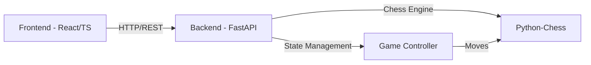

# Chess Bot Arena 🤖♟️

[](https://reactjs.org/)
[](https://www.python.org/)
[](https://fastapi.tiangolo.com/)
[](https://www.typescriptlang.org/)
[](https://www.docker.com/)
[](https://kubernetes.io/)

A sophisticated chess application featuring AI gameplay, real-time visualization, and advanced analysis tools. Watch AI opponents battle it out while analyzing their strategies and performance in a modern, responsive interface.


## 🌟 Key Features

### 🎮 Advanced Chess Engine
- **AI vs AI Matches**: Watch sophisticated chess engines compete in real-time
- **Deep Analysis**: Step through games move by move with detailed insights
- **Custom Settings**: Fine-tune AI behavior and match parameters

### 🖥️ Professional Interface
- **Live Updates**: Smooth, real-time board visualization
- **Game Analysis**: Track and analyze game progression
- **System Health**: Built-in monitoring and auto-recovery
- **Mobile Ready**: Responsive design for all devices

### 🛠️ Enterprise Features
- **Cloud Ready**: Full Kubernetes deployment support
- **Containerized**: Docker-based deployment
- **Developer Friendly**: Tilt.dev integration
- **Quality Assured**: Comprehensive testing suite

## 🏗️ System Architecture



## 🚀 Setup Guide

### System Requirements
- Docker & Docker Compose
- Python 3.11+
- Node.js 18+
- Poetry
- Yarn

### Installation Steps

1. **Setup Environment**:
```bash
# Backend Setup
cd backend && poetry install

# Frontend Setup
cd ../frontend && yarn install
```

2. **Launch Application**:

```bash
# Recommended: Docker Compose
docker compose up --build --detach --watch

# Alternative: Manual Launch
# Terminal 1 - Chess Engine
cd backend
poetry run python -m ai_chess_experiments.bot_runner

# Terminal 2 - Web Interface
cd frontend
yarn dev
```

## 🔍 Technical Details

### Component Structure
```
chess-bot/
├── backend/                 # Chess Engine & API
│   ├── ai_chess_experiments/
│   └── tests/
├── frontend/               # Web Interface
│   ├── src/
│   ├── e2e/               # E2E Tests
│   └── __tests__/         # Unit Tests
├── k8s/                   # K8s Configuration
├── charts/                # Helm Charts
└── Tiltfile              # Dev Environment
```

### Development Tools
- `yarn dev`: Launch development server
- `poetry run python -m ai_chess_experiments.bot_runner`: Start chess engine
- `./test.sh`: Execute test suite
- `./run_tests.sh`: Run specific tests

## 🌐 System Access

- **Web Interface**: http://localhost:3000
- **API Endpoint**: http://localhost:8000
- **API Documentation**: http://localhost:8000/docs
- **System Metrics**: http://localhost:8000/metrics

## 📚 API Documentation

### Core Endpoints
| Endpoint | Method | Description |
|----------|---------|-------------|
| `/health` | GET | System health status |
| `/api/game` | GET | Current game state |
| `/api/move/{move_uci}` | POST | Execute move |
| `/api/new_game` | POST | Initialize new game |

## ⚙️ System Configuration

### Backend Configuration
```toml
[tool.poetry.dependencies]
python = "^3.11"
python-chess = "^1.999"
fastapi = "^0.109.0"
uvicorn = "^0.27.0"
```

### Environment Settings
Required `.env` configuration:
```env
REACT_APP_API_URL=http://localhost:8000
DEBUG=true
```

## 🔧 Built With

- [python-chess](https://python-chess.readthedocs.io/) - Chess engine core
- [chessboard.jsx](https://github.com/willb335/chessboardjsx) - React chess interface 